## 📱 Home Care Services Application

### 📖 Project Description
The Home Care Services Application is an Android-based solution designed to provide users with a convenient and efficient way to book household maintenance services. The application offers a user-friendly interface through which users can access professional services such as **Cleaning, Plumbing, Mechanical, and Electrical work**.

Upon launching the application, users are directed to a **Sign-Up** screen to create a new account. Existing users can securely log in using **Firebase Authentication**. After successful authentication, users are navigated to the **Home Screen**, where the user’s name is displayed along with categorized service options, including Cleaning, Plumber, Mechanic, Electrician, and an option to view all available services.

Each category presents a list of service providers. By selecting a specific provider, the user can view detailed information such as service description and pricing. The application allows users to book services by filling out a structured booking form that includes user details, service price, selected date, preferred time, and complete address.

Once the booking is confirmed, all booking-related information is securely stored in the **Firebase Realtime Database**. Users can view their booking history directly from the home screen, including ongoing, completed, or canceled services. The application also provides users with the ability to cancel bookings independently. Any updates made to booking status in the database, such as service completion, are reflected in real time within the application.

Additionally, the application includes a **Favorites (Cart) feature**, allowing users to save preferred services for future reference. All service categories, booking details, and favorite items are dynamically retrieved from the Firebase Realtime Database, ensuring real-time data synchronization.

This project highlights the practical implementation of **Android application development concepts**.

### 🔧 Technologies Used
- Android Studio
- Java / Kotlin
- XML
- Firebase Authentication
- Firebase Realtime Database

## 📸 App Screenshots

### 🔐 Authentication
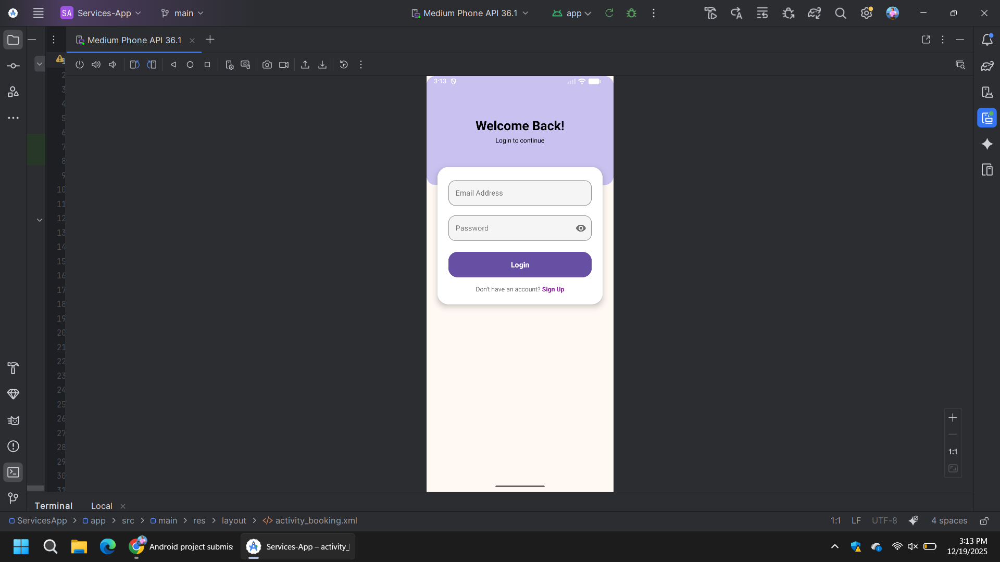
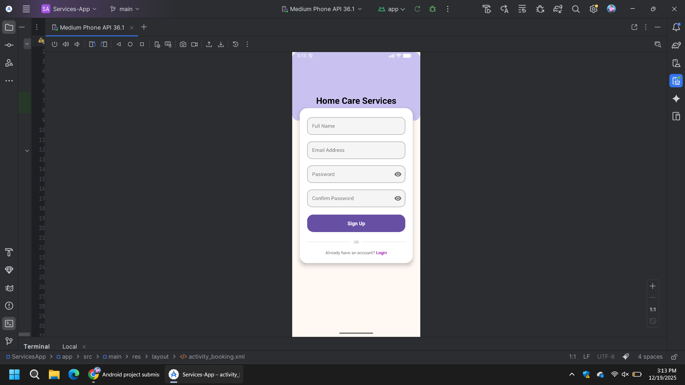

### 🏠 Home & Categories

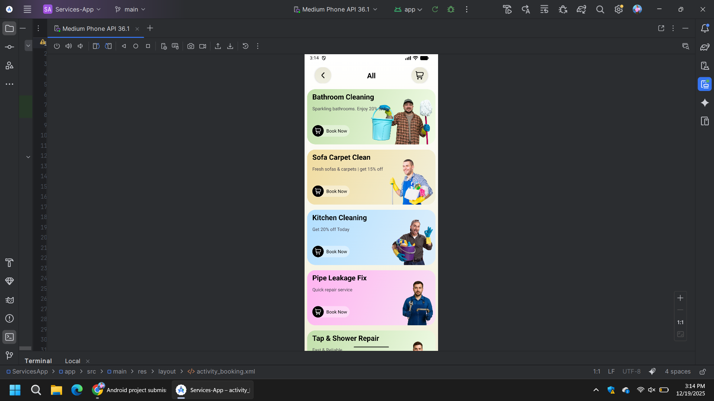

### 🛠️ Service Categories
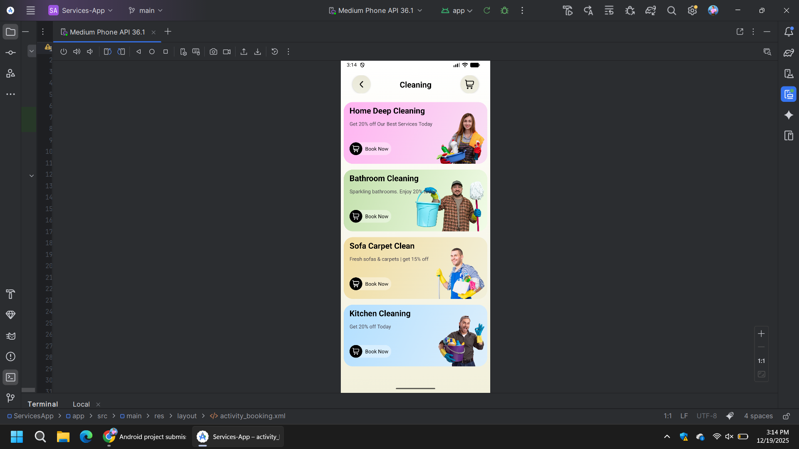
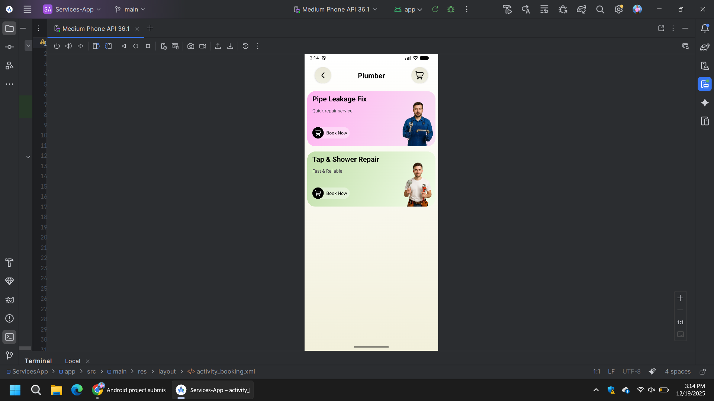
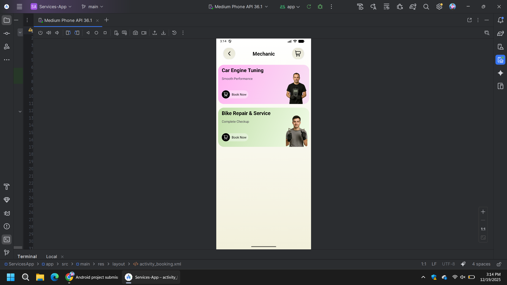
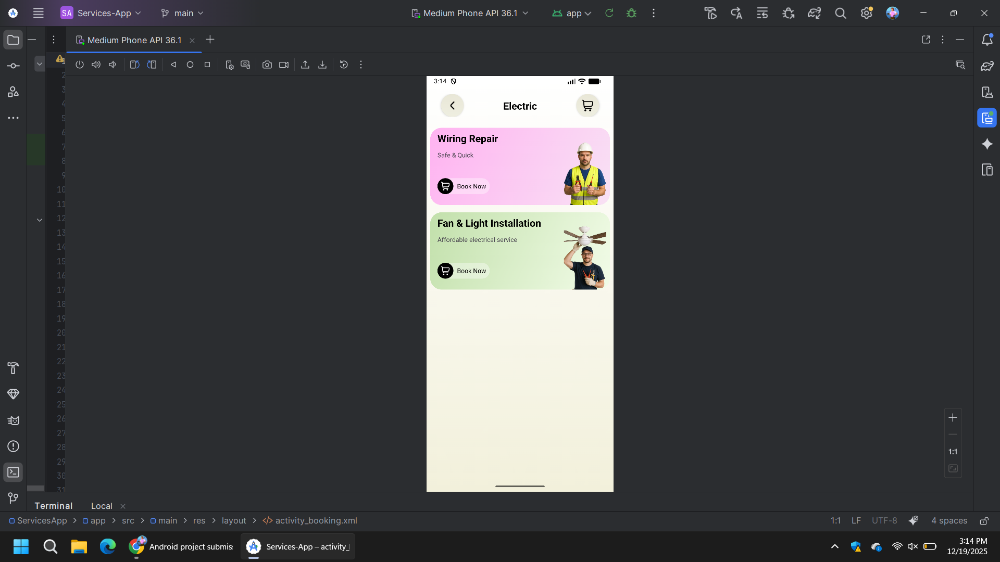

### 📄 Service Details
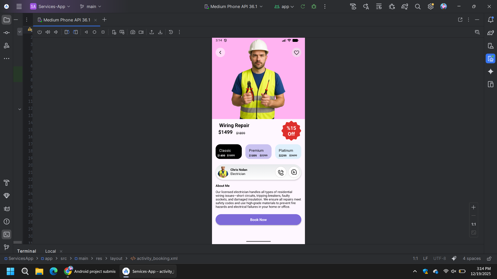

### 📅 Booking

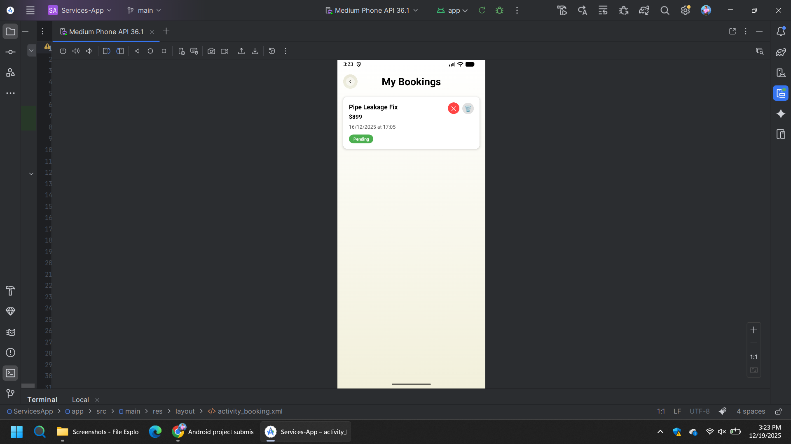

### ❤️ Favorites
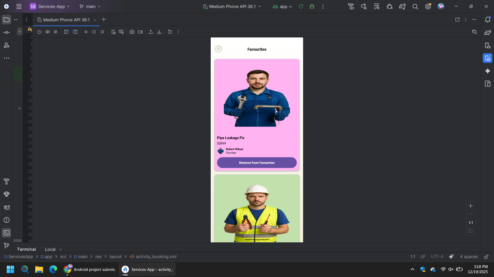

### 👤 Profile
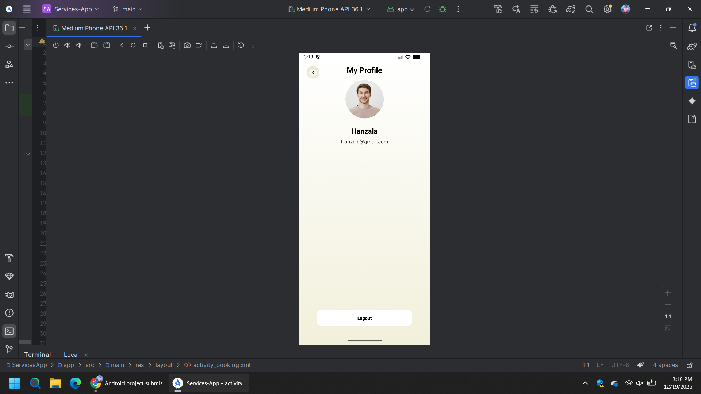

---

## 📌 Note
All screenshots represent the working state of the application and were captured during testing on a real device/emulator.
